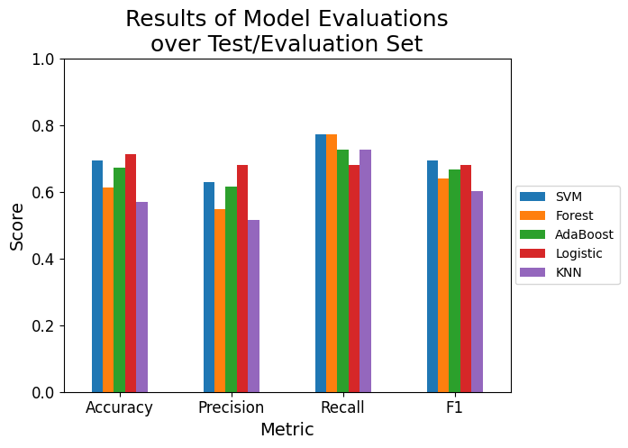
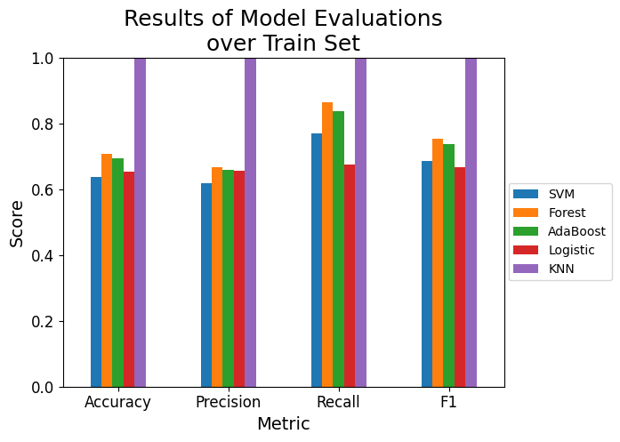

# Model for Predicting Growth Milestone of Plants

## Abstract
This project aims to create a supervised learning model for plant growth milestone prediction based on environmental and management factors involved in plant care.

## Author, Affiliation and Contact
Alexis Aguilar [Student of Bachelor's Degree in "Tecnologías para la Información en Ciencias" at Universidad Nacional Autónoma de México [UNAM](https://www.unam.mx/)]: alexis.uaguilaru@gmail.com

Project developed for the subject "Sistemas Basados en Conocimientos" (Machine Learning: Supervised Learning) for the class taught in semester 2025-2.

## License
Project under [MIT License](LICENSE)

## Introduction
Understanding and being able to predict when plant growth is significant becomes an important task for industrial agriculture, since this leads to an optimization of resources (time, materials and human resources) that results in higher profits and lower losses for the farmer. Therefore, based on the data set [[1]](#references) it will be tested whether it is possible to determine the growth of a plant based on a reduced set of observations and simplified parameters, as well as possible interactions that can be detected based on the different comments and observations made.

## General Aim
The purpose of this work is to present a classification model capable of determining whether a plant will have significant growth based on environmental and management factors.

## About the Dataset
The data set was taken [[1]](#references). It contains the measurements such as the amount of sunlight hours, temperature and humidity, as well as those concerning soil type, irrigation frequency, type of fertilizer and whether there was a significant growth.

## Exploratory Data Analysis (EDA)
The process related to data exploration is found in [Exploratory Data Analysis](./ExploratoryDataAnalysis/ExploratoryDataAnalysis.ipynb), where the procedures carried out to acquire different knowledge and insights about the dataset being worked with are presented. Where it is highlighted how the presence of fertilizers (organic or not) favors the significant growth of plants and that the other factors have complex interactions between them to generate their influence on plant growth. In addition, it was determined that the classes are not linearly separable, that is, that there is an overlap in the values taken by the factors, so that a plant may or may not have significant growth even with the same environmental or care factors.

## Machine Learning Models
The process related to the definition, training, evaluation and selection of Machine Learning models can be found in [Machine Learning Models](./Model/MachineLearningModel.ipynb), where the fundamental part about the metrics for determining when a model is better during the training stage as well as the metrics used for the evaluation and final selection of the model with the best expected behavior is broken down. It is highlighted that the models with the best behaviors in the test set have in common that they are linear models, or that they have linear decision edges, indicating that the generated features favored, in general, for the training of the models.

  
  

## Model Selection
Based on the graphs shown in the section above and together with the final observations presented in [Machine Learning Models](./Model/MachineLearningModel.ipynb), it is concluded that the best model for this task is the one based on Logistic Regression, mainly due to the assumptions it makes to capture the simple (linear) relationships that are predominant in the dataset.

## Conclusions
When considering the context of the problem together with the results obtained, and specifically that the best scores are associated with linear models, it is possible to find a theoretical configuration of the factors considered where significant plant growth is achieved in most cases. This process can be assumed not to have a high computational cost, because the interactions between the attributes, including the derived and generated ones, are linear or simple to be captured by any of the models.

This has the implication of having benefits to the agriculture industry because plants can be made to reach their maximum growth, their maximum production, with an ideal configuration of the factors involved. Specifically, more sophisticated models that do not require so much computational complexity could be generated to generate more refined predictions about the growth of a plant and adapt them to a more specific type of plant.

## References
* [1] Plant Growth Data Classification. Kaggle, Gor Torozyan. https://www.kaggle.com/datasets/gorororororo23/plant-growth-data-classification/data